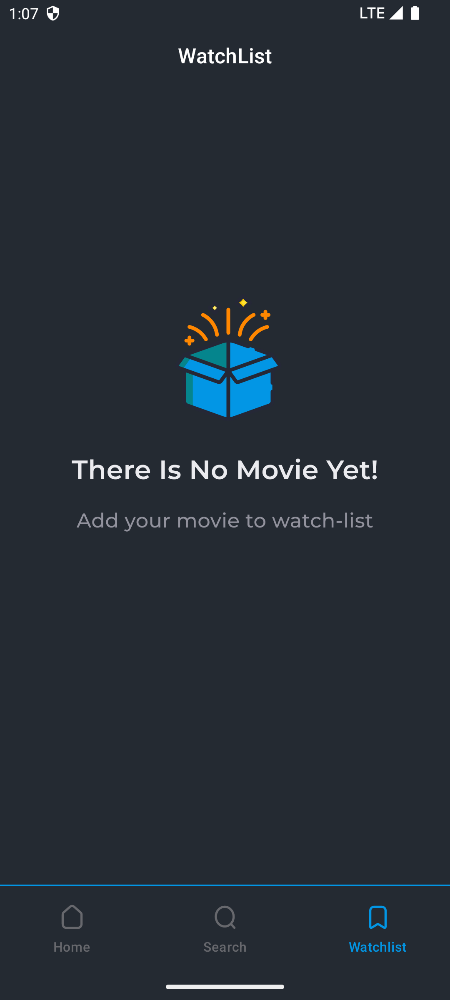

# Movies
## A Kotlin Multiplatform App to show about movies using TMDB Api

### Used Technology
* Kotlin-Multiplatform
* Compose-Multiplatform
* Koin
* Ktor
* Room
* Landscapist image loader

### Screens
* Home Screen
* Search Screen
* WatchList Screen
* Details Screen

### UI Demo:

#### Splash & Home
 &nbsp;

#### Search Screen [ Empty & With Search Result ]
 &nbsp;

#### Watchlist Screen [ Empty & With Watchlist items ]
 &nbsp;

#### Movie Detail Screen
 &nbsp;

